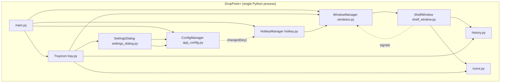

# DropPoint+ — Migration Plan: Electron → PySide6 (Qt6)

> **Status:** plan + working scaffold complete (2026-08-10)
> **Stack decision:** rebuild from scratch in **PySide6** — the official Qt for
> Python bindings (LGPL, actively maintained). The old Electron app stays in
> `../Droppoint-old/` as the behavioural reference.

---

## 0. TL;DR

| | |
|---|---|
| **Old app** | DropPoint 1.3.1 — Electron 43, `src/` main process + HTML/CSS/JS renderer, electron-store, electron-builder |
| **New app** | DropPoint+ — single-process PySide6 app in `droppointplus/` |
| **What was found missing** | PySide6, PySide6-QtHotkey, PyInstaller (Python 3.14 + pip are present; PyPI not reachable from this sandbox) |
| **Scaffold already created** | config, icons, history, shelf window with drag-in/out, window manager, tray, global hotkey, settings dialog, entry point |
| **Backlog features folded into v1** | move-mode (delete source after drag-out), configurable + live-rebinding global shortcut, re-enabled instance history with tray submenu |

**What disappears for free in the Qt rewrite:** the renderer process, the IPC
layer (`ipcMain`/`ipcRenderer`/preload/contextBridge), the splash-screen
keepalive hack, Tailwind/Preline, and the entire web-security surface
(`nodeIntegration: true` — issue #51 is moot by construction).

---

## 1. What "py6/qt" means

There is no "Python 6". The target stack is:

- **Python 3.14** (installed, 64-bit) — the interpreter
- **Qt 6** via the **PySide6** bindings — the GUI toolkit (Qt's equivalent of
  what Electron gets from Chromium + Node)

Qt6 provides everything the Electron app used: frameless/transparent windows,
always-on-top flags, system tray, global shortcuts (via QHotkey), native
drag-and-drop, and multi-screen geometry.

---

## 2. Environment audit — what's present vs missing

| Item | Needed for | Status (this machine) | Action |
|---|---|---|---|
| Python 3.14.0 (64-bit) | runtime | ✅ present | use it |
| pip | package manager | ✅ present | — |
| PySide6 | Qt6 UI bindings | ✅ installed (6.11.1, verified 2026-08-10) | — |
| Global hotkey | Win32 `RegisterHotKey` via `ctypes` | ✅ built-in — no dependency | nothing to install |
| PyInstaller | packaging (Phase 4) | ✅ installed (dev extra) | — |
| Node 24 / npm 11 | only runs the *old* Electron app | ✅ present | not used by DropPoint+ |

**Python 3.14 wheel note:** PySide6 6.8+ publishes cp314 wheels (3.14 was
released Oct 2025); `pip install PySide6` will resolve the latest 6.x line.
If a wheel ever fails to resolve, use a Python 3.12/3.13 venv instead — the
code targets 3.10+ and is not 3.14-specific.

---

## 3. Codebase analysis (the old Electron app)

### 3.1 What DropPoint does

A cross-platform desktop utility: summon a small floating window with a global
shortcut, drag files into it from one place, drag them back out somewhere else
— across virtual desktops and over fullscreen apps. Lives in the system tray;
multiple shelf "instances" can be open at once. Inspired by Dropover/Yoink.

### 3.2 File-by-file disposition

| Old file | Responsibility | Disposition |
|---|---|---|
| `src/App.js` | entry, splash keepalive, tray+shortcut wiring, spawn-on-launch | **Port → `main.py`** (keepalive via `setQuitOnLastWindowClosed(False)`; splash hack dropped) |
| `src/Window.js` | `Instance` class: frameless/transparent/always-on-top shelf, cursor or centre positioning | **Port → `shelf_window.py` + `windows.py`** |
| `src/Tray.js` | tray menu New Instance/Settings/Quit, double-click spawn, (commented-out) history submenu | **Port → `tray.py`**, history submenu **re-enabled** |
| `src/Shortcut.js` | global shortcut, toggle/spawn semantics, macOS Cmd+Q | **Port → `hotkey.py`** (native Win32 backend) + configurable/live-rebinding |
| `src/Settings.js` | settings window | **Port → `settings_dialog.py`** |
| `src/RequestHandlers.js` | IPC: `startDrag`, minimise, debugPrint, config fetch/apply | **Absorbed** — direct method calls, no IPC |
| `src/preload.js` | contextBridge between windows | **Drop** — no renderer process |
| `src/configOptions.js` | schema + defaults | **Port → `app_config.py`** (+ 2 new keys) |
| `src/Icons.js` | per-file-type icons, platform app icon | **Port → `icons.py`** (assets reused) |
| `src/History.js` | instance history JSON (**disabled**, relative-path bug) | **Port + fix → `history.py`**, re-enabled, stable app-data path |
| `renderer/droppoint.js` + `static/index.html` | shelf UI: drag-over animation, icon stack, drag-out, close | **Rewrite → `shelf_window.py`** painting + event handlers |
| `renderer/settings-renderer.js` + `static/settings.html` | schema-driven settings UI (Tailwind + Preline) | **Rewrite → `settings_dialog.py`** (QFormLayout from same schema) |
| `test/smoke.spec.js` | Playwright boot smoke test | **Replace → pytest smoke** (§11) |
| `.github/workflows/build.yml` | electron-builder matrix | **Rewrite → PyInstaller matrix** (Phase 4) |
| `package.json` / `electron-builder` / `electron-updater` | deps, packaging, auto-update | **Replace** → `requirements.txt`/`pyproject.toml`, PyInstaller, `tufup` (Phase 4) |

### 3.3 Architecture critique — carried into the rebuild

| Old problem (from `Droppoint-old/docs/planning/PLANNING.md` §4) | How DropPoint+ fixes it |
|---|---|
| `new Store(configOptions)` repeated in 5 files → schema drift | one `ConfigManager` built in `main()`, passed down |
| shared preload conflates two windows' concerns | no preload at all |
| `nodeIntegration: true` + contextBridge mixed security posture (issue #51) | gone by construction (no web content) |
| `History.js` writes to bare relative path (CWD-dependent) | `history.py` always writes under the OS app-data dir |
| dead code left as comments (tray history, history init, splash timers) | only shipped features exist; nothing is commented-out |
| no instance registry; toggle shortcut crashes at 0 windows (`active_instances[0]`) | `WindowManager` registry; 0 windows → spawn |
| zero automated tests | pytest strategy (§11) |

---

## 4. Target architecture

```
DroppointPlus/
├── MIGRATION_PLAN.md
├── README.md
├── requirements.txt / pyproject.toml
└── droppointplus/
    ├── main.py              # QApplication + wiring            (was src/App.js)
    ├── app_config.py        # schema, defaults, ConfigManager  (was configOptions.js + electron-store)
    ├── file_service.py      # drag mechanics + file ops        (infrastructure layer)
    ├── shelf_view_model.py  # shelf state + orchestration      (application layer)
    ├── shelf_window.py      # the shelf widget — pure View     (was Window.js + renderer/droppoint.js)
    ├── colors.py            # design tokens — single colour source of truth
    ├── windows.py           # WindowManager registry           (implicit in old app)
    ├── tray.py              # QSystemTrayIcon + menu           (was Tray.js)
    ├── hotkey.py            # global hotkey, native Win32 ctypes (was Shortcut.js)
    ├── settings_dialog.py   # schema-driven settings           (was Settings.js + settings renderer)
    ├── icons.py             # file-type icons                  (was Icons.js)
    ├── history.py           # instance history (re-enabled)    (was History.js)
    ├── widgets/             # reusable DropZone/FileCard/ProgressWidget
    └── resources/icons/     # assets reused from the original project
```



### Key design changes

1. **No renderer / no IPC.** The old app's `RequestHandlers.js` + `preload.js`
   + renderer scripts collapse into direct Python calls and Qt signals.
2. **Keepalive without the splash hack.** `QApplication.setQuitOnLastWindowClosed(False)`
   + tray icon keep the process alive; the hidden splash `BrowserWindow` is
   deleted, not ported.
3. **One config store with live notifications.** `ConfigManager.changed(key)`
   lets the hotkey re-register the instant settings are applied — answering
   the old "re-register without restart?" open question with *yes*.
4. **Stable data directory.** Both `config.json` and `instanceHistory.json`
   live under `QStandardPaths.AppDataLocation` (`%APPDATA%\DropPointPlus\DropPoint+`
   on Windows) — the History relative-path bug cannot recur.

---

## 5. Development skills compliance

The project follows `DropPoint_Plus_Development_Skills.md` (four skills:
Architecture, Python, PySide6/Qt, Decoupled Development). This section tracks
compliance — what the scaffold already satisfies and what is still planned.

### 5.1 The four skills at a glance

| Skill | Core requirements |
|---|---|
| **1 — Architecture** | layered design (Presentation → Application → Domain → Infrastructure), dependencies flow inward, low coupling / high cohesion, no giant classes, no global-state abuse |
| **2 — Python** | Python 3.12+, `pathlib`, dataclasses for models, type hints everywhere, small functions, `logging` not `print`, never silently swallow exceptions, threads/queues for heavy work |
| **3 — PySide6/Qt** | MVVM/MVC (no business logic in widgets), signals & slots, long ops off the UI thread (`QThread`/`QRunnable`/`QThreadPool`), reusable `widgets/`, adaptive layouts, High-DPI |
| **4 — Decoupled dev** | UI decides WHAT, services decide HOW; dependency injection; event-driven communication; replaceability (DB/UI/storage/plugins) without rewriting the app |

### 5.2 Compliance status

| Requirement | Status | Where / planned |
|---|---|---|
| Dataclasses for models | ✅ done | `models.py` — frozen `FileItem` (`path: Path`, `file_type`) with JSON (de)serialization keeping the old history keys |
| Type hints + `pathlib` | ✅ done | all modules; `Path` used throughout |
| `logging` instead of `print` | ✅ done | module loggers + `logging.basicConfig` in `main.py` (DEBUG when the `debug` setting is on) |
| No silent exception swallowing | ✅ done | config load/persist, history read/write and move-mode delete failures all logged (`debug`/`warning`/`exception`) |
| MVVM shelf: View ↔ ViewModel ↔ Service | ✅ done | `shelf_window.py` (pure View) → `shelf_view_model.py` (state/dedup/orchestration) → `file_service.py` (drag-in/out mechanics, delete, history) |
| Dependency injection | ✅ done | `ConfigManager`, shared `FileService`, `WindowManager` injected via constructors; drag-out orchestration unit-tested with a fake service |
| Event-driven communication | ✅ done | Qt signals (`files_changed`, `close_requested`, `changed(key)`, hotkey `activated`) |
| Single colour source of truth | ✅ done | `colors.py` — design tokens (dark Material-3 palette from the mockups); no UI module hardcodes a colour |
| Python 3.12+ floor | ✅ done | `pyproject.toml` `requires-python = ">=3.12"` |
| Long ops off the UI thread | ✅ done | move-mode deletion runs on a `DeleteWorker` (`QThread`) started by `FileService` (operation manager → worker thread → file system); `progress(done, total)` + `failed(item)` signals stream into the shelf's `ProgressWidget`; failures logged + counted, window closes only when the thread finishes (skills §3–§4) |
| Reusable `widgets/` package | ✅ done (skeleton) | `droppointplus/widgets/`: `DropZone`, `FileCard`, `ProgressWidget` — presentation-only, signals out raw data; migrating the shelf onto them is optional polish |
| Settings/tray MVVM | ⚠️ planned | `SettingsDialog` is schema-driven (thin, acceptable); introduce a `SettingsViewModel` if it gains business logic |
| pytest suite | ⚠️ planned | codify the MVVM + drag checks (drop/dedup/history, drag-out orchestration) into `tests/` (Phase 5 / next pass) |
| Adaptive / High-DPI layouts | ⚠️ planned | the shelf is a fixed 360×450 floating window (mockup scaled 90%), freely draggable from the header/empty area; layouts apply to dialogs and any future widgets |

Planned items map to Phases 3 and 5 of the roadmap (§9).

---

## 6. Feature-by-feature mapping (Electron API → Qt6)

| Electron feature / API | Old location | Qt6 equivalent | Notes |
|---|---|---|---|
| `BrowserWindow` frameless + transparent | `Window.js` | `QWidget` + `Qt.FramelessWindowHint` + `WA_TranslucentBackground` | scaffold ✓ |
| `alwaysOnTop: true` | `Window.js` | `Qt.WindowStaysOnTopHint` | scaffold ✓ (needs `setWindowFlag` for a live toggle) |
| hide from taskbar (implicit) | `Window.js` | `Qt.Tool` | tool windows never appear in taskbar/Alt-Tab — behaviour improvement |
| `setVisibleOnAllWorkspaces(true)` | `Window.js` | macOS: NSWindow `collectionBehavior` via pyobjc; elsewhere no-op | **not in scaffold** — see risks §10 |
| `screen.getCursorScreenPoint()` | `Window.js` | `QCursor.pos()` | scaffold ✓ |
| `screen.getPrimaryDisplay().workArea` | `Window.js` | `screen.availableGeometry()` (`QGuiApplication.screens()`) | scaffold ✓ |
| `globalShortcut.register("Shift+Capslock")` | `Shortcut.js` | Windows: `ctypes` `RegisterHotKey` + `QAbstractNativeEventFilter` (`WM_HOTKEY`) — the same OS mechanism Electron uses; macOS/Linux backends (RegisterEventHotKey / XGrabKey) planned | scaffold ✓ (Windows) + live rebind |
| macOS `Cmd+Q` quit | `Shortcut.js` | with the macOS hotkey backend (Phase 3) | planned |
| `Tray` + `Menu.buildFromTemplate` | `Tray.js` | `QSystemTrayIcon` + `QMenu`/`QAction` | scaffold ✓ |
| tray double-click → new instance | `Tray.js` | `activated` signal → `DoubleClick` | scaffold ✓ |
| `event.sender.startDrag({files, icon})` | `RequestHandlers.js` | `QDrag` + `QMimeData.setUrls([QUrl.fromLocalFile(p)])` + `drag.setPixmap(icon)` + `drag.exec(...)` | scaffold ✓ — the core drag-out |
| `webUtils.getPathForFile(file)` / `File.path` | `preload.js`/renderer | `QUrl.toLocalFile()` in `dropEvent` | no bridge needed — scaffold ✓ |
| DOM `dragover/enter/leave/drop` | `renderer/droppoint.js` | `dragEnterEvent` / `dragMoveEvent` / `dragLeaveEvent` / `dropEvent` | scaffold ✓ |
| `ipcMain.on` / `ipcRenderer.send` | `RequestHandlers.js`/`preload.js` | direct calls + Qt signals | scaffold ✓ |
| `electron-store` | everywhere | `ConfigManager` (JSON, app-data dir) | scaffold ✓ — single instance |
| `nativeImage.createFromPath().resize({width: 64})` | `Icons.js`/`RequestHandlers.js` | `QIcon`/`QPixmap.scaled()` | scaffold ✓ |
| CSS tilt/drag-border animations | `index.html` | `QVariantAnimation` + `paintEvent` | dashed-border pulse scaffold ✓; icon tilt = polish |
| `backdrop-filter: blur(20px)` | `index.html` | not natively supported | flat translucent bg (see §10) |
| splash window keepalive | `App.js` | `setQuitOnLastWindowClosed(False)` | scaffold ✓ |
| schema-driven settings UI (Tailwind/Preline) | settings renderer | `SettingsDialog` + `CONFIG_SCHEMA` (QFormLayout) | scaffold ✓ |
| `electron-updater` | `package.json` | `tufup` or GitHub Releases downloader | Phase 4 |
| `electron-builder` (NSIS/dmg/AppImage) | `package.json` | PyInstaller + NSIS / `create-dmg` / `appimagetool` | Phase 4 |

---

## 7. Drag & drop deep-dive (the risky core)

### 7.1 Drag-in (`dropEvent`)

`event.mimeData().urls()` → `url.toLocalFile()` gives the absolute path
(equivalent of the removed `File.path`). Duplicate check by path; type bucket
from extension via `icons.guess_file_type()` (the old renderer used the
browser MIME prefix — same coarse buckets). Files are recorded in history and
the icon stack + count refresh.

### 7.2 Drag-out (`start_drag_out`)

- Mouse press on a loaded shelf arms the drag; a move ≥ 8 px starts it.
- `QDrag.exec(Qt.CopyAction | Qt.MoveAction)` **blocks** until the OS drop
  completes or is cancelled, returning the actual `DropAction`.
- The shelf then **closes itself** — the original sent `close-signal` the
  moment `startDrag` fired; closing *after* the drop is friendlier and is an
  intentional minor deviation. A cancelled drag (`IgnoreAction`, e.g. Esc)
  keeps the shelf and its files open so the user can retry.
- Move mode: if the drop wasn't cancelled (`action != Qt.IgnoreAction`) and
  `drag_action == "move"`, sources are deleted **on a worker thread**
  (`DeleteWorker`) — the shelf shows a `ProgressWidget` until the deletion
  finishes, then closes itself. The UI never blocks on the file system, and
  per-file failures are logged (with a summary) instead of aborting the rest.

### 7.3 Known limitations (inherited, not introduced)

- **Move-mode cannot confirm the destination wrote successfully** — the OS
  drag protocol doesn't report that back to the app (identical limitation to
  Electron; it was an open question in the old PLANNING.md §7).
- **Windows drag-cursor icon**: `QDrag.setPixmap` renders a flat bitmap cursor
  in some Explorer contexts — cosmetic only.

---

## 8. Backlog features folded into v1

| Backlog item | Design | Status |
|---|---|---|
| **Move mode** (#9/#45) | `drag_action: copy\|move` setting; delete sources after a completed drag-out | scaffold ✓ (files + dirs, background worker + progress) |
| **Dark UI (mockup replication)** | shelf follows `ui design/empty_drop_zone` (header + dashed drop zone + footer); colours from `colors.py` | scaffold ✓ — selected/drag-over state = purple highlight |
| **Configurable shortcuts** (#52/#42/#10) | `shortcut` string in config; `ConfigManager.changed` → live `QHotkey.setShortcut` | scaffold ✓ |
| **Instance history** (disabled feature) | `history.py` on the fixed app-data path; `add_to_instance` on every drop; tray History submenu (last 5, display-only) | scaffold ✓ |

Nice-to-haves for later: key-combo capture UI (replace the free-text shortcut
field with a recorder), clickable history entries that reopen files into a new
instance.

---

## 9. Roadmap

| Phase | Scope | Acceptance criteria |
|---|---|---|
| **0 — Environment** (30 min) | venv, `pip install -r requirements.txt`, verify PySide6 resolves on your Python | `python -m droppointplus` boots, tray icon appears |
| **1 — Core shelf** (2–3 d) | shelf window, drag-in/out, icons, multi-instance, cursor/centre positioning, always-on-top | drop files in from Explorer, drag them out into another folder; two shelves coexisting; Esc clears |
| **2 — System integration** (1–2 d) | tray menu, global hotkey + toggle/spawn, settings dialog with live rebind | hotkey opens/toggles shelves; settings apply without restart |
| **3 — Backlog** (2–3 d) | move-mode hardening, shortcut capture UI, history polish, per-platform quirks | move mode moves, history shows in tray, macOS all-workspaces + perms |
| **4 — Packaging & updates** (2–3 d) | PyInstaller one-dir builds; NSIS (Win) / create-dmg (mac) / AppImage (Linux); `tufup` or GitHub Releases auto-update | installers build in CI for all 3 OSes; auto-update path works |
| **5 — Hardening** (1–2 d) | pytest suite in CI, Wayland fallback, Windows HiDPI, animations polish | green CI; manual smoke on Win/mac/Linux |

Phases 0–2 are mostly **done in the scaffold** — treat them as verify-and-polish.

---

## 10. Risks & mitigations

| Risk | Severity | Mitigation |
|---|---|---|
| PySide6 wheel unavailable for Python 3.14 | Low | 6.8+ ships cp314 wheels; fallback to 3.12/3.13 venv |
| Caps Lock as global hotkey on Windows | Medium | RegisterHotKey handles it via QHotkey (Electron shipped the same combo); if it fails, ship `Shift+Tab` default — verify on Phase 0/2 |
| Wayland-only Linux: no global shortcuts (protocol) | Medium | document + degrade to tray; X11/XWayland fine |
| macOS: `setVisibleOnAllWorkspaces` equivalent | Medium | NSWindow `collectionBehavior = [.canJoinAllSpaces]` via pyobjc, behind `sys.platform == "darwin"`; add in Phase 3 |
| macOS Accessibility/Input-Monitoring prompts | Low | RegisterEventHotKey usually needs no permission; if it fails, guide the user to System Settings |
| No `backdrop-filter` blur in Qt | Low | flat `rgba(255,250,240,235)` background (already the practical look); optional `QGraphicsBlurEffect` on an overlaid image later |
| Qt hotkey bindings gone from PyPI (`qthotkey`, `PySide6-QtHotkey`, …) | Low | solved — native `ctypes` `RegisterHotKey` + `QAbstractNativeEventFilter`; zero deps, verified on Windows 2026-08-10 |
| macOS/Linux global hotkey backends not implemented yet | Medium | tray still fully works; RegisterEventHotKey (mac) / XGrabKey (X11) land in Phase 3 |
| Tray on Linux GNOME (AppIndicator) | Low | `QSystemTrayIcon` works on most desktops; AppIndicator-only sessions may need the extension — document |
| `QDrag` blocking loop | Low | `drag.exec()` is modal but nested in the main loop; no UI work needed during the drag |
| **Move mode deletes data** | High | default is `copy`; delete only after a *completed* drop; keep this explicitly user-chosen |
| Electron/Chromium behaviours people might expect (blur, webviews) | Low | out of scope — the plan documents intentional deviations |

---

## 11. Testing & CI strategy

The old app had exactly one Playwright smoke test. DropPoint+ gets:

- **pytest + pytest-qt unit tests** for pure logic: config round-trip + schema
  keys, `guess_file_type` buckets, history add/list, `WindowManager` toggle
  semantics (qtbot-created windows), position clamping math.
- **Smoke test** (Phase 5): boot `main()` offscreen (`QT_QPA_PLATFORM=offscreen`
  or xvfb), assert tray + window creation, then quit.
- **Scripted drag smoke** (optional, CI Linux under xvfb): synthesize a
  `QDragEnterEvent`/`dropEvent` with file URLs directly on the widget — no OS
  drag needed for the unit-level check; a real OS drag stays a manual check.
- **CI**: GitHub Actions matrix (windows-latest / macos-latest / ubuntu with
  xvfb) — `pip install -e .[dev]`, `pytest`, then PyInstaller build per OS.

---

## 12. What's already scaffolded

```
DroppointPlus/
├── MIGRATION_PLAN.md            ← this document
├── README.md
├── requirements.txt
├── pyproject.toml               (console script: `droppointplus`)
├── .gitignore
└── droppointplus/
    ├── __init__.py  __main__.py
    ├── main.py                 entry point
    ├── app_config.py           schema + defaults + ConfigManager
    ├── file_service.py         drag mechanics + DeleteWorker (background move-mode delete), history (service)
    ├── shelf_view_model.py     shelf state, dedup, orchestration (view model)
    ├── shelf_window.py         shelf View: renders VM state, forwards input
    ├── windows.py              WindowManager: registry + toggle/spawn
    ├── tray.py                 tray + History submenu
    ├── hotkey.py               native Win32 RegisterHotKey (ctypes) + live rebind
    ├── settings_dialog.py      schema-driven settings + toast
    ├── icons.py                file-type icons + app icon
    ├── history.py              re-enabled, fixed path
    ├── widgets/                DropZone, FileCard, ProgressWidget (reusable)
    └── resources/icons/        assets reused from the original project
```

**To run:** `pip install -r requirements.txt && python -m droppointplus`.
Verified on this machine (PySide6 6.11.1; clean real-platform boot — tray,
shelf window and hotkey registration all start without errors).

**Deliberately not ported:** splash screen, `minimise` IPC (the ✕ closes the
shelf, as in the original), dead History call sites, the settings-renderer
stub fixture, Tailwind/Preline.

---

## 13. License

DropPoint+ is GPL-3.0-or-later. Icon assets in `resources/icons/` are reused
from the original DropPoint project (GPL-3.0-or-later).
